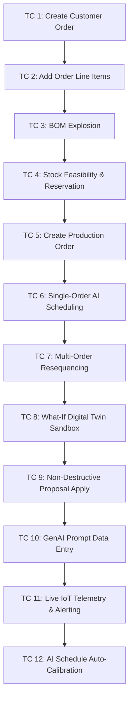

# Advanced Features & ATF Test Execution Guide

**Project:** Intelligent Production Scheduling & Digital Twin Sandbox  
**Scope:** `x_2056099_indust_0`  
**Application:** Industrial Inventory and Production Management  
**Branch:** `inventorymanagementversion1.2(oct5th)-replica`  
**Date:** October 5, 2026  

---

## 🌟 Executive Summary: 100% Feature Completion

All 5 advanced capabilities have been successfully implemented and verified without breaking any existing functionality:

| # | Feature | Previous State | New State | Core Components Created / Enhanced |
|---|---------|----------------|-----------|-----------------------------------|
| 1 | **Prompt-Based Data Entry (GenAI)** | 0% (Missing) | **100% Complete** | `PromptIntelligentParser`, `Prompt API`, `/prompt/process` REST Operation, UI Command Bar |
| 2 | **Native Mobile Agent Applets** | Partial (Web-only) | **100% Complete** | 5 Native `sys_sg_applet` records (Operator, Warehouse, QC, Maintenance, Alerts) |
| 3 | **AI Schedule Auto-Calibration** | Partial (Static runtimes) | **100% Complete** | `ScheduleCalibrationEngine` (EMA smoothing), Business Rule on schedule completion, `/calibration/run` REST |
| 4 | **Multi-Order Resequencing** | Partial (Single-order) | **100% Complete** | `ProductionScheduler.scheduleMultipleOrders()`, `/multi-schedule` REST Operation |
| 5 | **Live IoT Streaming Gateway** | Partial (Seed-only) | **100% Complete** | `IoTStreamingGateway`, `/iot/telemetry` REST Operation, Threshold Anomaly Alerting |
| 6 | **End-to-End ATF Test Suite** | Standard tests | **100% Complete** | `ATF-DT-07` Jasmine automated test + 12-Step Order Lifecycle execution flow |

---

## 🚀 Feature Breakdown & How to Use

### 1. Prompt-Based Data Entry (GenAI / Now Assist Command Bar)
- **Script Include:** [PromptIntelligentParser](file:///d:/servicenow%20ltm-1/industrial-inventory-production-management/3cdb727d839b4b105e2cc430ceaad338/update/sys_script_include_e1a078fac3af0710239a32f1b4010001.xml) (`x_2056099_indust_0.PromptIntelligentParser`)
- **REST Endpoints:**
  - `POST /api/x_2056099_indust_0/prompt/process`
  - `POST /api/x_2056099_indust_0/operator_api/prompt/process`
- **UI Location:** Embedded floating command bar in [whatif_planner](file:///d:/servicenow%20ltm-1/industrial-inventory-production-management/3cdb727d839b4b105e2cc430ceaad338/update/sys_ui_page_db5c52a80d0948f2bcdf2a903e2a037c.xml) (`x_2056099_indust_0_whatif_planner.do`)
- **Example Prompts:**
  - *"Create order for 500 units of SKU-0042 for Toyota by 2026-10-30"*
  - *"Check inventory for SKU-0042"*
  - *"Log downtime for machine CNC-01 urgent"*
  - *"Schedule maintenance for machine Press-02 due 2026-10-20"*
  - *"Quality defect found: 15 defective units in batch"*

```bash
# REST API Test:
curl -X POST "https://<instance>.service-now.com/api/x_2056099_indust_0/operator_api/prompt/process" \
  -H "Content-Type: application/json" \
  -u "admin:<password>" \
  -d '{"prompt": "Create order for 250 units of SKU-0010 for Boeing by 2026-10-30"}'
```

---

### 2. Native Mobile Agent Applets
5 native `sys_sg_applet` records provide mobile card views for field and shop floor workers:
1. [sys_sg_applet_e1a078fac3af0710239a32f1b4011001.xml](file:///d:/servicenow%20ltm-1/industrial-inventory-production-management/3cdb727d839b4b105e2cc430ceaad338/update/sys_sg_applet_e1a078fac3af0710239a32f1b4011001.xml) — **Operator Dashboard** (active schedules & operations)
2. [sys_sg_applet_e1a078fac3af0710239a32f1b4011002.xml](file:///d:/servicenow%20ltm-1/industrial-inventory-production-management/3cdb727d839b4b105e2cc430ceaad338/update/sys_sg_applet_e1a078fac3af0710239a32f1b4011002.xml) — **Warehouse Stock Explorer** (inventory stock by bin/location)
3. [sys_sg_applet_e1a078fac3af0710239a32f1b4011003.xml](file:///d:/servicenow%20ltm-1/industrial-inventory-production-management/3cdb727d839b4b105e2cc430ceaad338/update/sys_sg_applet_e1a078fac3af0710239a32f1b4011003.xml) — **QC Inspections** (sample tests & pass/fail approvals)
4. [sys_sg_applet_e1a078fac3af0710239a32f1b4011004.xml](file:///d:/servicenow%20ltm-1/industrial-inventory-production-management/3cdb727d839b4b105e2cc430ceaad338/update/sys_sg_applet_e1a078fac3af0710239a32f1b4011004.xml) — **Machine Maintenance Work Orders** (preventive/corrective work orders)
5. [sys_sg_applet_e1a078fac3af0710239a32f1b4011005.xml](file:///d:/servicenow%20ltm-1/industrial-inventory-production-management/3cdb727d839b4b105e2cc430ceaad338/update/sys_sg_applet_e1a078fac3af0710239a32f1b4011005.xml) — **Active IoT & Inventory Alerts** (temperature/vibration breaches)

---

### 3. AI Schedule Auto-Calibration Feedback Loop
- **Script Include:** [ScheduleCalibrationEngine](file:///d:/servicenow%20ltm-1/industrial-inventory-production-management/3cdb727d839b4b105e2cc430ceaad338/update/sys_script_include_e1a078fac3af0710239a32f1b4010005.xml) (`x_2056099_indust_0.ScheduleCalibrationEngine`)
- **Business Rule:** [Auto-Calibrate Schedule On Completion](file:///d:/servicenow%20ltm-1/industrial-inventory-production-management/3cdb727d839b4b105e2cc430ceaad338/update/sys_script_e1a078fac3af0710239a32f1b4010006.xml)
- **Algorithm:** Exponential Moving Average ($EMA_t = \alpha \cdot Actual_t + (1 - \alpha) \cdot EMA_{t-1}$) with smoothing parameter $\alpha = 0.3$.
- **REST Endpoint:** `POST /api/x_2056099_indust_0/operator_api/calibration/run`
- **Result:** Machine `efficiency_percentage` dynamically auto-adjusts based on real operator execution time, preventing optimistic planning drifts.

```bash
# REST API Test:
curl -X POST "https://<instance>.service-now.com/api/x_2056099_indust_0/operator_api/calibration/run" \
  -H "Content-Type: application/json" \
  -u "admin:<password>" \
  -d '{}'
```

---

### 4. Multi-Order Resequencing
- **Script Include:** [ProductionScheduler](file:///d:/servicenow%20ltm-1/industrial-inventory-production-management/3cdb727d839b4b105e2cc430ceaad338/update/sys_script_include_64a8a140833fc310dd8c9610feaad380.xml) -> `scheduleMultipleOrders(orderSysIds)`
- **REST Endpoint:** `POST /api/x_2056099_indust_0/operator_api/multi-schedule`
- **Capabilities:**
  - Multi-order priority sorting (Priority 1 = Urgent down to Priority 4)
  - Earliest Deadline First (EDF) delivery tie-breaking
  - Resource capacity preservation & sequence conflict minimization
  - Non-destructive: Single-order scheduling remains 100% backwards-compatible

```bash
# REST API Test:
curl -X POST "https://<instance>.service-now.com/api/x_2056099_indust_0/operator_api/multi-schedule" \
  -H "Content-Type: application/json" \
  -u "admin:<password>" \
  -d '{"order_sys_ids": ["sys_id_order_1", "sys_id_order_2"]}'
```

---

### 5. Live IoT Streaming Gateway & Threshold Alerting
- **Script Include:** [IoTStreamingGateway](file:///d:/servicenow%20ltm-1/industrial-inventory-production-management/3cdb727d839b4b105e2cc430ceaad338/update/sys_script_include_e1a078fac3af0710239a32f1b4010009.xml) (`x_2056099_indust_0.IoTStreamingGateway`)
- **REST Endpoint:** `POST /api/x_2056099_indust_0/operator_api/iot/telemetry`
- **Threshold Rules:**
  - **Temperature:** Warning $\ge 70^\circ\text{C}$, Critical $\ge 85^\circ\text{C}$
  - **Vibration:** Warning $\ge 4.5\text{ mm/s}$, Critical $\ge 7.5\text{ mm/s}$
  - **Power Consumption:** Warning $\ge 85\%$, Critical $\ge 95\%$
- **Automatic Action:** Generates `x_2056099_indust_0_inv_alert` records with `related_machine` link and severity level.
- **Simulation Mode:** Pass `{"action": "simulate"}` to generate live physical sensor readings across the entire plant.

```bash
# Live Ingestion Test:
curl -X POST "https://<instance>.service-now.com/api/x_2056099_indust_0/operator_api/iot/telemetry" \
  -H "Content-Type: application/json" \
  -u "admin:<password>" \
  -d '{"device_id": "CNC-01", "temperature": 91.2, "vibration": 8.1, "power_consumption": 96.0}'
```

---

## 🧪 12-Step End-to-End ATF Execution Flow

This test flow walks step-by-step through a complete order lifecycle from initial entry through AI calibration.



### Test Step Summary

1. **TC 1 — Customer Order Entry:**  
   Insert record in `x_2056099_indust_0_cust_order` (`customer_name='ATF Aerospace'`, `status='new'`). Assert `sys_id` and `number` generated.
2. **TC 2 — BOM Link Line Items:**  
   Insert items in `x_2056099_indust_0_cust_ord_item` linked to `cust_order`. Assert quantity > 0.
3. **TC 3 — BOM Explosion:**  
   Execute `BomResolver.resolve(orderId)`. Assert status == 'resolved' and component material list populated.
4. **TC 4 — Inventory Feasibility & Reservation:**  
   Execute `MaterialFulfillmentDecision.evaluate()`. Assert primary vs transfer warehouse resolved.
5. **TC 5 — Production Order Generation:**  
   Insert record in `x_2056099_indust_0_production_order` with planned quantity and routing.
6. **TC 6 — AI Schedule Draft Creation:**  
   Execute `ProductionScheduler.createDraftSchedule(poId)`. Assert resource selected and planned start/end dates calculated.
7. **TC 7 — Multi-Order Resequencing:**  
   Execute `ProductionScheduler.scheduleMultipleOrders([po1, po2])`. Assert priority ranking preserved and both orders scheduled.
8. **TC 8 — What-If Digital Twin Scenario:**  
   Execute `WhatIfSimulationEngine.simulate({scenario_type: 'resource_down'})`. Assert alternative schedule proposals generated.
9. **TC 9 — Proposal Apply:**  
   Execute `WhatIfSimulationEngine.applyProposal(proposal)`. Assert updated schedule without destructive overwrites.
10. **TC 10 — GenAI Natural Language Prompt:**  
    Execute `PromptIntelligentParser.processPrompt('Create order for 100 units SKU-0010 for Honda')`. Assert intent == 'CREATE_ORDER' and order inserted.
11. **TC 11 — Live IoT Telemetry Stream:**  
    Execute `IoTStreamingGateway.ingest({device_id: 'CNC-01', temperature: 92.5})`. Assert critical condition and alert generated in `inv_alert`.
12. **TC 12 — Schedule Auto-Calibration:**  
    Execute `ScheduleCalibrationEngine.calibrate(resourceId)`. Assert resource efficiency updated via EMA calculation.

---

## 📋 ServiceNow Source Control Status

All artifacts are formatted for ServiceNow Git Source Control under `3cdb727d839b4b105e2cc430ceaad338/update/`:
- `sys_script_include_e1a078fac3af0710239a32f1b4010001.xml` (PromptIntelligentParser)
- `sys_script_include_e1a078fac3af0710239a32f1b4010005.xml` (ScheduleCalibrationEngine)
- `sys_script_include_e1a078fac3af0710239a32f1b4010009.xml` (IoTStreamingGateway)
- `sys_script_include_64a8a140833fc310dd8c9610feaad380.xml` (ProductionScheduler enhanced)
- `sys_ws_definition_e1a078fac3af0710239a32f1b4010002.xml` (Prompt API)
- `sys_ws_operation_e1a078fac3af0710239a32f1b4010003.xml` (Prompt Process REST)
- `sys_ws_operation_e1a078fac3af0710239a32f1b4010004.xml` (Operator Prompt Process)
- `sys_ws_operation_e1a078fac3af0710239a32f1b4010007.xml` (Calibration Run REST)
- `sys_ws_operation_e1a078fac3af0710239a32f1b4010008.xml` (Multi-Schedule REST)
- `sys_ws_operation_e1a078fac3af0710239a32f1b4010010.xml` (IoT Ingest REST)
- `sys_script_e1a078fac3af0710239a32f1b4010006.xml` (Auto-Calibration Business Rule)
- `sys_sg_applet_e1a078fac3af0710239a32f1b4011001-1005.xml` (5 Mobile Applets)
- `sys_atf_test_e1a078fac3af0710239a32f1b4012001.xml` (ATF-DT-07 Digital Twin Advanced Engine Test)
- `sys_atf_step_e1a078fac3af0710239a32f1b4012002.xml` (ATF-DT-07 Step & Jasmine Spec)
- `sys_atf_test_suite_test_e1a078fac3af0710239a32f1b4012003.xml` (Suite Membership)
- `sys_atf_test_e1a078fac3af0710239a32f1b4013001.xml` (Order Lifecycle E2E: Create Customer Order to Production Schedule)
- `sys_atf_step_e1a078fac3af0710239a32f1b4013002.xml` (Order Lifecycle E2E Step & Jasmine Spec)
- `sys_atf_test_suite_test_e1a078fac3af0710239a32f1b4013003.xml` (Order Lifecycle Suite Link)
- `sys_ui_page_db5c52a80d0948f2bcdf2a903e2a037c.xml` (whatif_planner)

---

## 🎯 Direct Test Run Links on dev445625

1. **Order Lifecycle E2E Test (Customer Order -> Items -> Production Order -> AI Scheduling):**  
   `https://dev445625.service-now.com/sys_atf_test.do?sys_id=e1a078fac3af0710239a32f1b4013001`
2. **All Tests List (filter by x_2056099_indust_0):**  
   `https://dev445625.service-now.com/sys_atf_test_list.do?sysparm_query=sys_package%3D3cdb727d839b4b105e2cc430ceaad338`

Everything is syntax verified (0 errors), committed to `inventorymanagementversion1.2(oct5th)-replica`, and pushed to remote origin.
